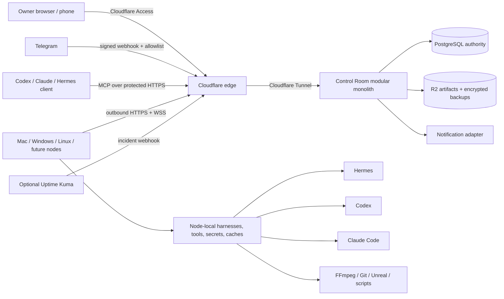
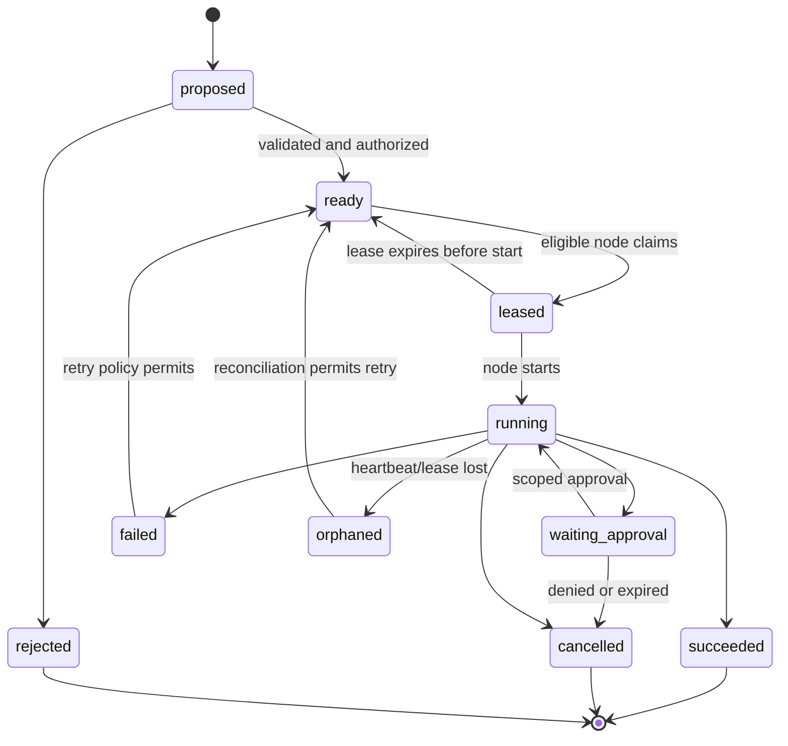

# CR-3 consolidated architecture

**Status:** Accepted 2026-08-22
**Milestone:** CR-3  
**Scope:** Architecture and phased build plan only; no live project integration or production credential use

## Outcome

Control Room is a private, project-agnostic, harness-neutral orchestration control plane. It coordinates work across machines and projects without turning any one AI harness, project, VPN, cloud, or operating system into the platform core.

The initial deployment is a modular monolith on Johnny5, the Ubuntu VPS, plus a small outbound node bridge on each participating machine. A single PostgreSQL database is authoritative. Nodes retain bounded journals and caches for interruption recovery, but they are not database replicas and cannot elect a new Control Room primary.

The repository may eventually be public. The architecture therefore assumes that an attacker can read every line of source, every endpoint shape, and every protocol description. Security depends on cryptographic identity, least privilege, local enforcement, explicit approvals, isolation, replay protection, and rapid revocation—not secrecy of implementation.

## System context



## Architectural layers

### 1. Owner surfaces

- Responsive Control Room dashboard.
- Telegram notification and low/medium-risk response surface.
- Northbound MCP server for Codex, Claude Code, Hermes, and other authorized clients.
- Protected deep links to native worker consoles such as the Hermes dashboard.

### 2. Control plane

One deployable application with internal modules, not a microservice fleet:

- identity and sessions;
- project/request intake;
- workflow and schedule engine;
- scheduler and placement evaluator;
- node registry and connection manager;
- approval and policy evaluator;
- project and harness adapter registry;
- artifact metadata and transfer broker;
- notifications and incidents;
- audit and operational API;
- dashboard and MCP transport.

Modules communicate through typed interfaces and transactional events. They may be separated into services later, but v1 does not pay the deployment, network, and consistency costs of microservices.

### 3. Data plane

- PostgreSQL is the only writable global authority.
- R2 stores large artifacts, immutable manifests, backup material, and optional audit anchors.
- Source projects remain authoritative when their authority mode is `source_scheduled` or `advisory`.
- Node-local stores contain only bounded delivery journals, leased-job envelopes, checkpoints, idempotency receipts, telemetry spool, policy snapshots, and artifact caches.

### 4. Node plane

Every machine runs one node bridge appropriate to its OS. The bridge:

- enrolls the device and protects its private key;
- maintains an outbound connection to Control Room;
- discovers hardware, storage, OS, installed tools, harnesses, and versions;
- runs approved capability probes and benchmarks;
- advertises current capacity and health;
- claims and renews eligible jobs;
- invokes harness adapters and deterministic executors;
- resolves secrets locally immediately before use;
- enforces node-local policy even if the server requests more;
- checkpoints progress and uploads artifacts;
- buffers safe events while disconnected and reconciles on reconnect.

The bridge is not a general remote shell. Every executor declares typed operations, parameters, risk class, resource limits, and output contract.

### 5. Extension plane

Four independent adapter families prevent project and harness lock-in:

| Adapter family | Answers | Examples |
|---|---|---|
| Project adapter | What does this project's work mean and who owns transitions? | Content Blooms, Lo-Fi Wayfarer, an ABS article |
| Harness adapter | How is an agent turn started, streamed, steered, cancelled, resumed, and measured? | Hermes, Codex, Claude Code |
| Executor adapter | How is deterministic work invoked and verified? | Git, tests, FFmpeg, Unreal, health checks |
| Infrastructure adapter | How are external resources reached without becoming platform authority? | R2, GitHub, Telegram, Bitwarden, 1Password, Kuma |

Adapters publish capability manifests and pass conformance tests. They do not receive direct database access.

## Deployment topology

### Johnny5 VPS

Johnny5 is the initial Control Room host because it is always on and already operates public services. The expected deployment supports either:

1. Docker Compose: Control Room app, PostgreSQL, `cloudflared`, and optional monitoring on a private container network; or
2. native Ubuntu services: systemd units for the app, PostgreSQL, `cloudflared`, and supporting processes.

Discovery chooses the path. The architecture does not assume that Docker is currently installed merely because Hostinger offers Docker templates.

The current Hostinger KVM2 offering is modest—2 vCPU, 8 GB RAM, and 100 GB NVMe—so the control plane must remain lightweight. GPU rendering, transcription, and model inference belong on worker nodes, not the VPS. The VPS may run low-intensity CPU jobs when benchmarked and explicitly eligible.

### Mac node

- Native launchd-managed node bridge.
- Hermes, Codex, Claude Code, local models, and Mac-specific accelerators behind adapters.
- Local OS keychain or configured password-manager broker.
- Optional Docker only for a job that benefits from it; not a platform requirement.

### Windows node

- Native Windows Service or approved service wrapper.
- Job Objects for process-tree ownership and cancellation.
- Native GPU executors for RTX/FFmpeg and future media workloads.
- Hermes may run through WSL2 if that remains the supported route; the node bridge still presents one normalized Windows node.
- Only trusted first-party work until Windows containment has passed its acceptance tests.

### Future Linux, macOS, Windows, and cloud nodes

New nodes use the same enrollment and capability protocol. Their operating system affects executors and containment, not the global scheduler or project contracts.

## Network model

The recommended production path is ordinary outbound TLS traffic:

- `cloudflared` creates an outbound tunnel from the VPS; the origin need not expose Control Room or PostgreSQL ports publicly.
- Node bridges initiate outbound HTTPS/WebSocket connections over port 443.
- PostgreSQL listens only on loopback or the private container network.
- Hermes dashboards and other native consoles remain localhost/tailnet/private unless accessed through a narrowly protected tunnel.
- Tailscale remains an optional administration and repair path, not a prerequisite for job delivery.
- Proton VPN conflicts cannot stop the core design because the bridge uses conventional outbound HTTPS; OS routing still needs an onboarding connectivity test.

No custom VPN is required. Network location is an additional restriction, never identity or authorization.

## Canonical work model

```text
Request
  -> Workflow
      -> Job
          -> Attempt
              -> Lease
              -> Checkpoints
              -> Artifact manifests
              -> Outcome
      -> Approval / Question / Review
      -> Decision
```

- A **request** may be a short one-off instruction or an ongoing project objective.
- A **workflow** is a versioned graph created from a project pack, template, or manager proposal.
- A **job** is the schedulable unit with immutable authority and requirement envelopes.
- An **attempt** records one placement and execution history.
- An **approval** is bound to an exact operation digest, scope, expiry, and actor.
- A **service** represents continuously desired state and observations rather than a job that completes forever.
- A **schedule** creates finite attempts or service checks without flooding the main board.

### Job lifecycle



Consequential external effects use an intent record plus an idempotency key. “Exactly once” is not promised across arbitrary third-party systems. The executor must either use destination idempotency, reconcile an effect intent, or require human resolution after an ambiguous failure.

## Scheduling and bottleneck analysis

Hard eligibility is deterministic and evaluated before scoring:

```text
capability + version + benchmark
AND skill/package availability and trust
AND credential reference resolvability
AND project/environment/node policy
AND approval state
AND current CPU/GPU/RAM/storage/network capacity
AND availability window and maintenance state
```

Eligible routes are scored using project share debt, priority, age, critical-path impact, downstream unlocks, locality, expected duration, cost, quality, reliability, and operator preferences. The manager agent may explain or recommend, but it cannot override hard eligibility or policy.

Bottlenecks are calculated from demand, eligible capacity, queue age, observed service rate, utilization, failure rate, and downstream blocking. Recommendations must expose evidence and assumptions—for example, “adding an 8 GB VRAM slot would increase this route from one to two concurrent jobs”—rather than generate generic upgrade advice.

## Interfaces

### Human dashboard

Portfolio, project, worker, attention, review, schedule/service, incident, settings, and audit surfaces share a single responsive UI. The dashboard does not embed secret-bearing native dashboards. It displays normalized information and opens protected deep links when specialized administration is needed.

### Telegram

Telegram can deliver status, questions, previews, and buttons. Low- and medium-risk decisions may be completed there when policy permits. High-risk actions open a short-lived dashboard approval page and require stronger owner confirmation. Telegram chat identity alone is not sufficient for production publishing, spending, secret rotation, node enrollment, or permission expansion.

### Northbound MCP

The Control Room MCP server lets an authorized Codex, Claude Code, or Hermes session create a request, propose a workflow, inspect sanitized state, delegate jobs, retrieve artifacts, and request approval. MCP is not the internal queue, lease system, or secret transport.

### Node protocol

The node protocol uses versioned HTTPS and WebSocket messages with explicit compatibility negotiation, unique message IDs, timestamps, nonces, body digests, acknowledgements, and bounded replay windows. Delivery is at least once; mutations are idempotent.

## Project examples used as conformance cases

### Content Blooms

- Existing source remains scheduling authority initially.
- Mac Whisper route, Windows route, or VPS CPU route can be compared.
- Control Room requests placement changes and observes source receipts.
- Research, transcription, writing, image creation, GitHub handoff, deployment, and monitoring can form one reviewable workflow.

### Lo-Fi Wayfarer

- Control Room-native jobs may coordinate Unreal scene generation, render segments, audio generation, QC, review, FFmpeg assembly, upload preparation, and performance reporting.
- Large media stays local/R2; PostgreSQL stores manifests and review metadata.
- GPU slots, scratch thresholds, render rates, and transition dependencies expose the actual bottleneck.

### Short ABS article request

- A request entered from dashboard, Telegram, or MCP can create a small workflow.
- Research may run on the Mac, a draft on another route, image work locally or through an approved provider, and deployment on Johnny5.
- The same contracts work without pretending every request is a permanent project.

## Architecture invariants

1. Public source disclosure does not reduce security.
2. No worker or adapter receives direct global database access.
3. No node accepts work solely because it came from the network.
4. No job can expand its own authority or its descendants' authority.
5. A compromised online server cannot change node-local ceilings or forge separately protected owner approval.
6. Secrets do not enter prompts, central job payloads, logs, artifacts, URLs, or audit metadata.
7. PostgreSQL is the single writable global authority; caches are disposable and journals are reconcilable.
8. R2 is not a lock, lease, database, or command bus.
9. AI explanations never replace deterministic policy, validation, or verification.
10. Live integrations require explicit phase approval and their own acceptance tests.

## CR-3 completion boundary

CR-3 documents the architecture and implementation plan. It does not:

- enroll Johnny5, the Mac, or Windows PC;
- install Docker, PostgreSQL, or services;
- create Cloudflare Access or Tunnel resources;
- connect Telegram, R2, GitHub, Bitwarden, or 1Password credentials;
- invoke Hermes, Codex, Claude Code, Content Blooms, or Lo-Fi Wayfarer;
- expose any endpoint or mutate any production project.

Those actions occur only in approved implementation phases with rollback and verification.

## Primary infrastructure references

- [Hostinger VPS plans](https://www.hostinger.com/vps-hosting?lang=en)
- [Hostinger Docker VPS support](https://www.hostinger.com/support/8306612-how-to-use-the-docker-vps-template-at-hostinger/)
- [Hostinger managed VPS firewall](https://www.hostinger.com/support/8172641-how-to-use-a-managed-vps-firewall-at-hostinger/)
- [Cloudflare Tunnel](https://developers.cloudflare.com/tunnel/)
- [Cloudflare Access service tokens](https://developers.cloudflare.com/cloudflare-one/access-controls/service-credentials/service-tokens/)
- [Cloudflare Access JWT validation](https://developers.cloudflare.com/cloudflare-one/access-controls/applications/http-apps/authorization-cookie/validating-json/)
- [PostgreSQL backup and recovery](https://www.postgresql.org/docs/17/backup.html)
- [PostgreSQL standby and streaming replication](https://www.postgresql.org/docs/17/warm-standby.html)
- [Tailscale interoperability](https://tailscale.com/docs/reference/interoperability)
- [Docker daemon protection](https://docs.docker.com/engine/security/protect-access/)
